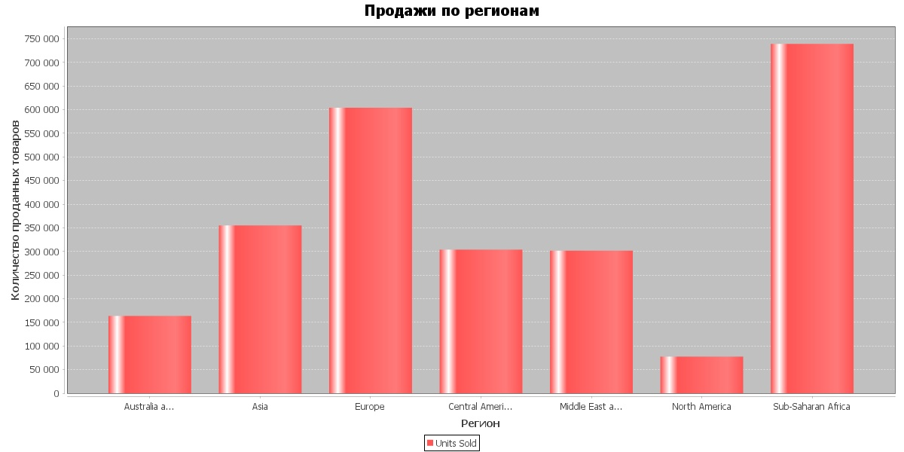
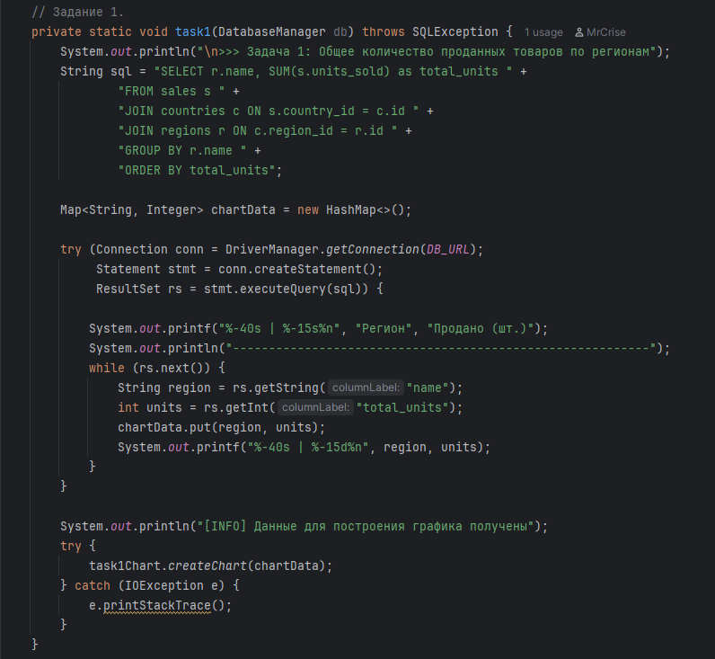
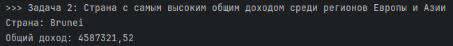
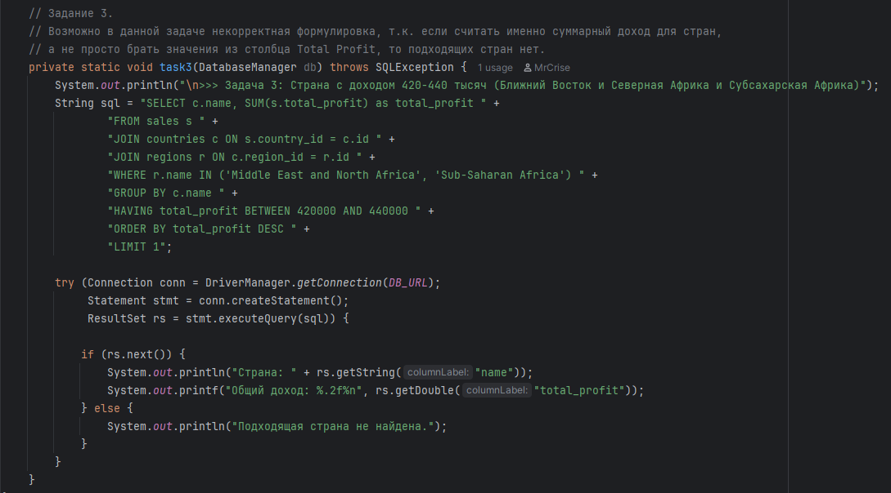
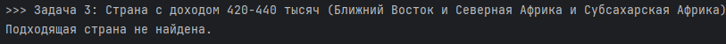

# Итоговый проект: Продажа продуктов в мире (Вариант 6)
### Выполнил Самойлов Андрей, ПА-01

---

## Технологический стек
*   **Язык:** Java
*   **Сборка:** Maven
*   **База данных:** SQLite
*   **Библиотеки:** `sqlite-jdbc` (драйвер БД), `JFreeChart` (для построения графиков).

---

## Последовательность работы над проектом

В ходе выполнения проекта были реализованы следующие этапы:

---

### 1. Анализ предметной области и проектирование классов
Я проанализировал CSV файл, на его основе создал класс `Sale` для первичного хранения данных в памяти. Определил основные сущности для нормализации базы данных: Регионы, Страны, Типы товаров, Каналы продаж, Приоритеты.

---

### 2. Реализация парсера CSV
Далее я написал класс `CsvParser`, который считывает построчно CSV файл и отдаёт результат в виде листа из классов `Sale`.
*   Реализована обработка различных форматов дат (MDY и DMY), встречающихся в файле.
*   Реализован пропуск заголовков и пустых строк.

---

### 3. Cоздание Базы Данных
Для работы с БД я создал класс `DatabaseManager`.
Была создана база данных SQLite (`sales_variant6.db`).
Для соблюдения 3-ей нормальной формы (3NF) я вынес данные в связанные таблицы, чтобы исключить избыточность данных:
*   `regions` (Таблица с регионами)
*   `countries` (Таблица со странами, каждая страна также связана с регионом)
*   `item_types` (Таблица с типами товаров)
*   `sales_channels` (Таблица с каналами продаж)
*   `priorities` (Таблица с приоритетами)
*   `sales` (Основная таблица продаж, связанная с другими с помощью ключей)

---

### 4. Выполнение задания 1
Для выполнения первого задания я написал SQL запрос, который вывел для каждого региона сумму продаж в данном регионе.

На основе полученных данных я построил график с помощью библиотеки JFreeChart.

Ниже можно увидеть сам график, а также Java функцию для выполнения SQL запроса и построения графика.

---

### 5. Выполнение задания 2
Для выполнения второго задания я написал SQL запрос, который вывел страну с самым высоким доходом среди регионов Европы и Азии.

Ниже можно увидеть Java функцию для выполнения этого SQL запроса и её вывод в консоль.

---

### 6. Выполнение задания 3
Для выполнения второго задания я написал SQL запрос, который должен был выводить страну с общим доходом 420-440 тысяч, среди регионов Ближний Восток и Северная Африка и Субсахарская Африка с самым высоким общим доходом.

Но запрос ничего не вывел, т.к. такой страны не нашлось.

Возможно в данной задаче некорректная формулировка, т.к. если считать именно суммарный доход для стран,
а не просто брать значения из столбца Total Profit, то подходящих стран нет.

Ниже можно увидеть Java функцию для выполнения этого SQL запроса и её вывод в консоль.

---
